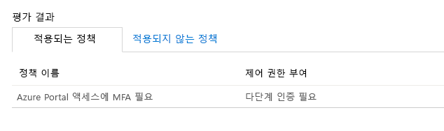

# 모듈 3 - 랩 1 - 연습 1 - MFA 인증 파일럿(Azure Active Directory 조건부 액세스를 사용하여 특정 앱에 MFA를 사용해야 하도록 설정)

### 작업 1: 조건부 액세스 정책 만들기 

이 랩에서는 특정 사용자가 MFA를 사용해야 하도록 설정하려면 필요한 조건부 액세스 정책을 만드는 방법을 살펴봅니다. 이 시나리오에서 사용되는 항목은 다음과 같습니다.

- Azure Portal(MFA를 사용해야 하는 클라우드 앱의 자리 표시자) 
- 조건부 액세스 정책을 테스트할 샘플 사용자  

정책에서 다음 항목을 설정합니다.

|설정 |값|
|---     | --- |
|사용자 및 그룹 | Patti Fernandez |
|클라우드 앱 | Microsoft Azure Management |
|액세스 권한 부여 | 다단계 인증 필요 |

 
1.  Azure Portal `https://portal.azure.com`에 Holly Dickson으로 로그인합니다. 암호로는 `Pa55w.rd`를 사용합니다.

2.  Azure Portal의 허브 메뉴에서 **Azure Active Directory**로 이동합니다. 필요한 경우 추가 서비스를 사용하여 Azure Active Directory를 검색합니다.

3. 왼쪽에서 **보안**을 클릭하고 **조건부 액세스**를 선택합니다.

     
 
5.  **조건부 액세스** 페이지 위쪽의 도구 모음에서 **새 정책**을 클릭합니다.

    **참고**: 이 옵션이 회색으로 표시되면 브라우저 세션을 새로 고치세요.

6.  **새로 만들기** 페이지의 **이름** 텍스트 상자에 `Require MFA for Azure portal access`를 입력합니다.

7.  **할당** 섹션에서 **사용자 및 그룹**을 클릭합니다.

8.  **사용자 및 그룹** 페이지에서 다음 단계를 수행합니다.

    a. **사용자 및 그룹 선택**을 클릭하고 **사용자 및 그룹**을 선택합니다.

    b. **선택**을 클릭합니다.

    c. **선택** 페이지에서 `Patti Fernandez`를 선택하고 **선택**을 클릭합니다.

9.  새로 만들기 페이지로 돌아와 **클라우드 앱 또는 작업**을 클릭합니다.

10. **클라우드 앱 또는 작업** 페이지에서 다음 단계를 수행합니다.

    a. **앱 선택**을 클릭합니다.

    b. **선택**을 클릭합니다.

    c. **선택** 페이지에서 **Microsoft Azure Management**를 선택하고 **선택**을 클릭합니다.

11.  **액세스 제어** 섹션에서 **부여**를 클릭합니다.

12.  **부여** 페이지에서 다음 단계를 수행합니다.
     1. **액세스 허용**을 선택합니다.
     2.  **다단계 인증 필요**를 선택합니다.
     3.  **선택**을 클릭합니다.

13.  **정책 사용** 섹션에서 **설정**을 클릭합니다.

14.  **만들기**를 클릭합니다.

    ‎**참고:** 정책 적용이 실패하면 작업 내용을 확인하고 **만들기**를 다시 클릭합니다.

### 작업 2: 시뮬레이션된 로그인 평가

조건부 액세스 정책을 구성했으므로 정책이 정상적으로 작동하는지 확인해야 합니다. 첫 단계에서는 조건부 액세스 가상 정책 도구를 사용하여 테스트 사용자의 로그인을 시뮬레이션합니다. 시뮬레이션은 정책에 대한 이 로그인의 영향을 예측하고 시뮬레이션 보고서를 생성합니다.  

여기서는 다음 정보를 사용하여 가상 정책 평가 도구를 초기화합니다.

- 사용자: **Patti Fernandez** 
- 클라우드 앱: **Microsoft Azure Management**

 **가상**을 클릭하면 다음 항목이 표시되는 시뮬레이션 보고서가 작성됩니다.

- **Azure Portal 액세스에 MFA 필요**(**적용되는 정책** 아래) 
- **컨트롤 권한 부여**: **다단계 인증 필요**

1.  조건부 액세스-정책 페이지 위쪽의 메뉴에서 **가상**을 클릭합니다.  
 
     

2.  **사용자**를 클릭하고 `Patti Fernandez`를 선택한 다음 **선택**을 클릭합니다.

3.  클라우드 앱을 선택하려면 다음 단계를 수행합니다.

    a. **클라우드 앱 또는 작업**을 선택합니다.

    b. **클라우드 앱 또는 작업 페이지**에서 **앱 선택**을 선택합니다.

    c. **선택**을 클릭합니다.

    d. **선택** 페이지에서 **Microsoft Azure Management**를 선택하고 **선택**을 클릭합니다.

    e. 클라우드 앱 또는 작업 페이지에서 **완료**를 선택합니다.

4.  가정 페이지에서 **가정**을 선택합니다.

5.  결과로 "Azure Portal 액세스에 MFA 필요"가 표시되는지 확인합니다.

     

### 작업 3: 조건부 액세스 정책 테스트

이전 섹션에서는 시뮬레이션된 로그인을 평가하는 방법을 알아보았습니다. 하지만 시뮬레이션뿐 아니라 조건부 액세스 정책도 테스트하여 정상 작동하는지 확인해야 합니다. 

정책을 테스트하려면 InPrivate 브라우징 세션을 열고 **Patti Fernandez** 계정을 사용하여 Azure Portal **`https://portal.azure.com`**에 로그인해 봅니다. 추가 보안 확인이 가능하도록 계정을 설정하라는 대화 상자가 나타납니다.

## 연습 2 계속 진행
