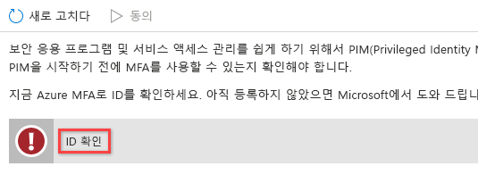
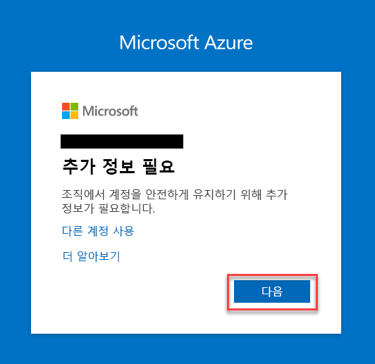

# 모듈 3 - 랩 2 - 연습 1 - Azure 리소스 관리

**시나리오**

이 랩에서는 Azure PIM(Privileged Identity Management)을 사용하여 JIT(Just-in-Time) 관리를 사용하도록 설정하고 권한 있는 작업을 수행할 수 있는 사용자 수를 제어하는 방법을 알아봅니다. 그리고 사용 가능한 여러 디렉터리 역할과, PIM을 비롯한 최신 기능을 리소스 수준의 역할 할당으로 확장하는 방법도 알아봅니다. 

### 작업 1: 리소스 검색

1.  아직 MOD 관리자로 Microsoft 365 관리 센터에 로그인되어 있으면 사용자를 Holly Dickson으로 전환합니다. **Azure Portal** `https://portal.azure.com/`으로 이동하여 전역 관리자인 Holly Dickson으로 로그인합니다. 그런 후에 **모든 서비스**를 클릭하고 `Azure AD Privileged Identity Management`를 검색하여 선택합니다.

     

1.  PIM에 동의하라는 메시지가 표시되면 동의를 클릭합니다. PIM이 이미 사용하도록 설정되어 있는 테넌트도 있습니다. 해당 테넌트에서는 이러한 단계를 수행할 필요가 없습니다.

     

1.  **ID 확인**이 표시되면 클릭합니다.

     

1.  **다음**을 클릭합니다.

     

1.  휴대폰 세부 정보를 입력하고 **다음**을 클릭합니다.

     
 
1.  코드가 SMS로 수신되면 입력하고 **확인**을 클릭합니다.

     

1. 확인이 정상적으로 완료되면 **완료**를 클릭합니다.

1.  Azure Portal에서 **모든 서비스**를 클릭하고 **Azure AD Privileged Identity Management**를 검색하여 선택합니다.

     

1.  PIM에 동의하라는 메시지가 표시되면 동의를 클릭합니다.

     

1.  **PIM에 동의** 블레이드로 돌아와 **동의**, **예**를 차례로 클릭합니다.

     

1.  **F5** 키를 눌러 Azure Portal을 새로 고칩니다.
   
    **참고**: 브라우저에서 Portal을 새로 고쳐도 PIM이 사용하도록 설정된 것으로 표시되지 않으면 Azure Portal에서 로그아웃했다가 다시 로그인합니다.

# 연습 2 계속 진행
