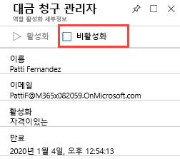

# 모듈 3 - 랩 2 - 연습 3 - PIM 역할 활성화 및 비활성화

### 작업 1: 역할 활성화

특정 Azure AD 디렉터리 역할을 맡아야 하는 경우 PIM에서 **내 역할** 탐색 옵션을 사용하여 활성화를 요청할 수 있습니다.

1.  Azure Portal에서 Holly로 로그인한 후 **모든 서비스**를 클릭하고 `Azure AD Privileged Identity Management`를 검색하여 선택합니다.

     

1.  **Azure AD 역할**을 클릭합니다.
 
1.  **빠른 시작**, **자격 할당**을 차례로 클릭합니다.

     

1.  `Billing Administrator`를 클릭하고 Patti Fernandez를 **대금 청구 관리자** 역할에 다시 추가합니다.

1.  **InPrivate** 브라우징 세션을 열고 `https://portal.azure.com`으로 이동하여 **Patti**로 로그인합니다. 로그인 시에는 PattiF@YourTenantHere.onmicrosoft.com과 같은 Patti의 UPN 및 웹 호스팅 공급자가 제공한 암호를 사용합니다(힌트: 암호는 MOD 관리자 암호와 동일할 가능성이 높음).  

1.  Azure Portal에서 **모든 서비스**를 클릭하고 **Azure AD Privileged Identity Management**를 검색하여 선택합니다.

     

1.  **Azure AD 역할**을 클릭합니다.

1.  **빠른 시작**, **역할 활성화**를 차례로 클릭합니다.

1.  대금 청구 관리자 역할에서 오른쪽으로 스크롤하여 **활성화**를 클릭합니다.

     

1.  **진행하기 전에 ID 확인**이 표시되면 클릭합니다. 세션당 한 번만 인증하면 됩니다. 마법사의 단계를 진행하여 Patti를 인증합니다.
 
1.  Azure Portal로 돌아와 **모든 서비스**를 클릭하고 `Azure AD Privileged Identity Management`를 검색하여 선택합니다.

1.  **Azure AD 역할**을 선택하고 빠른 시작 블레이드에서 **역할 활성화**를 클릭합니다.

1.  대금 청구 관리자 역할에서 오른쪽으로 스크롤하여 **활성화**를 클릭합니다.

     

1.  활성화 이유를 입력하고 **활성화**를 클릭합니다.

     

기본적으로는 설정에 명시적으로 구성된 경우가 아니면 역할을 승인할 필요가 없습니다. 

 승인할 필요가 없는 역할은 활성화되어 활성 역할 목록에 추가됩니다. 역할을 즉시 사용하려면 다음 섹션의 단계를 수행하세요.

 역할을 활성화하려면 승인이 필요한 경우에는 브라우저의 오른쪽 위에 요청이 승인 보류 중임을 알리는 알림이 나타납니다.

### 작업 2: 활성화 후 즉시 역할 사용

PIM에서 역할을 활성화하면 원하는 관리 포털에 액세스하거나 특정 관리 워크로드 내에서 기능을 수행할 수 있게 될 때까지 최대 10분이 걸릴 수 있습니다. 권한을 강제로 업데이트하려면 다음 단계의 설명에 따라 **애플리케이션 액세스** 페이지를 사용합니다.

1.  **로그아웃**을 클릭합니다.

1.  InPrivate 브라우징 세션에서 다시 Patti로 로그인합니다.

### 작업 3: 요청 상태 확인

활성화 보류 중인 요청의 상태를 확인할 수 있습니다.

1.  **Patti**로 로그인한 상태로 Azure Portal에서 **모든 서비스**를 클릭하고 `Azure AD Privileged Identity Management`를 검색하여 선택합니다.

1.  **Azure AD 역할**을 클릭합니다.

1.  **보류 중인 요청**을 클릭하여 요청 목록을 확인합니다.

### 작업 4: 역할 비활성화

활성화된 역할은 시간 제한(할당 가능한 기간)이 지나면 자동으로 비활성화됩니다.

관리자 작업이 일찍 완료되면 Azure AD Privileged Identity Management에서 역할을 수동으로 비활성화할 수도 있습니다.

1.  **Patti**로 로그인한 상태로 Azure AD Privileged Identity Management를 엽니다.

1.  **Azure AD 역할**을 클릭합니다.

1.  **내 역할**을 클릭합니다.

     

1.  **활성 할당**을 클릭하여 활성 역할 목록을 확인합니다.

1.  사용을 완료한 역할을 찾아 **비활성화**를 클릭합니다.

     

1.  **비활성화**를 다시 클릭합니다.

     

# 연습 4 계속 진행
